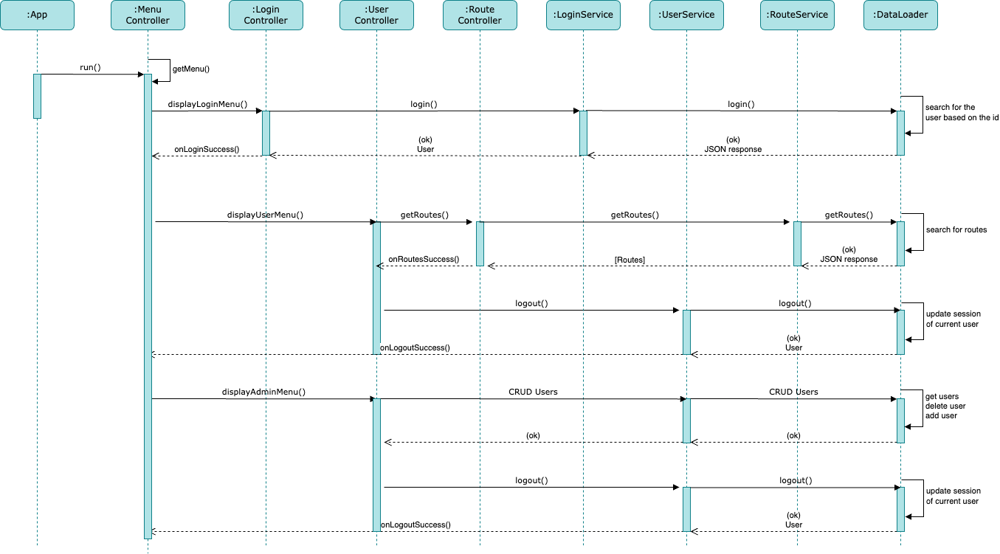
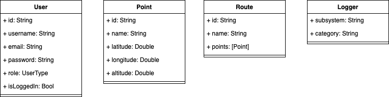
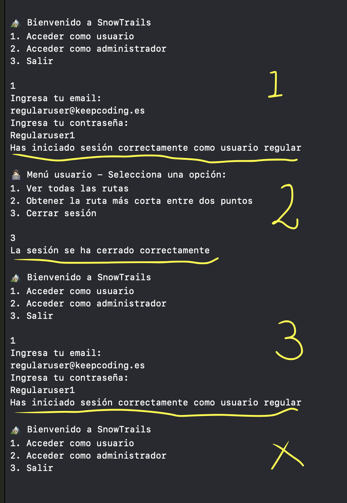
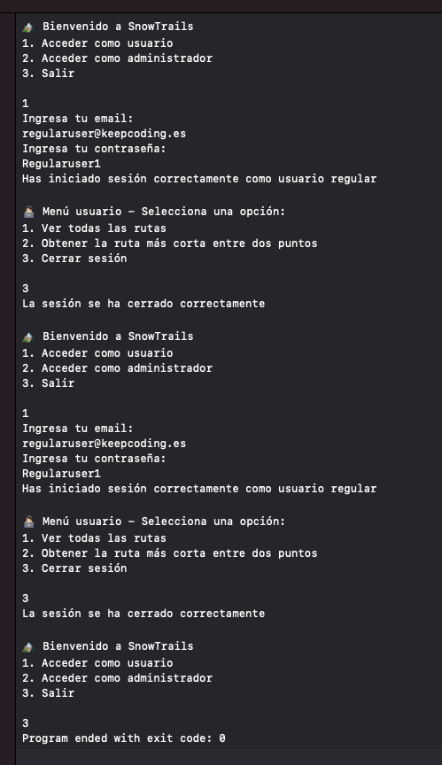

# snow_trails

Is an app where users can see info about routes easy and fast.

## Features included
1. **Mandatory features**
	* Login menu
	* Regular user menu
		* Display routes
		* Logout
	* Admin menu
		* Display users
		* Add user
		* Delete user
		* Logout
2. **Complementary features**
	* Login Menu
	* Admin menu
		* Add user
3. **Other implementation details**

## Architecture

The core of **SnowTrails** is the `App` entity who starts the app and manage the dependencies used around the project:

```
let app = App()
app.run()
```
Inside `App` I initialize a `MenuController` and its dependencies like `LoginController` that requires a `LoginService` and a `UserDataLoader`. The same aplies for the other controllers and its dependencies.

The main controller is the `MenuController` that handles all menus and trigger the righ controller when is needed.

Also I have **controllers** to interact whit the user, these controllers uses **services** to manage domain logic and comunicate with the **data loaders**. All of them are _clases_.

## Sequence diagram

This is a general diagram that includes the **Login**, **Regular User** and **Admin User** flows:



TODO: The **Shorter route** and **Add a point to route** features are still in progress and do not appear here.

## Entities


## Mandatory Features

### Login Menu

I coded he **Login** flow using a `LoginController`, a `LoginService`, a `UserDataLoader` and a `users.json` file to host two default users: regular and admin. 

 Throw a delegate called `LoginControllerDelegate` that implement the `MenuController` I close the login menu to start the corresponding user one. Previously I provided feedback to the user for a login sucess.

😮‍💨 **Problems everywhere**

When I was programming the **Logout** functionality, I figured out that the app's flow **had a problem**: When the user closed their session and tried to login/logout again, the **menu was broken**. The main problem as [@tecosabri](https://github.com/tecosabri) said, was that there was no more code to execute since the last option selected by the user in Login menu was `.Quit`, so the app's flow was terminated every time we open for a second time that controller. 

The first thing I realized was I needed to reset the data of `LoginController` before evaluating again. I applied this solution:  [7e8e576](https://github.com/anagumo/snow_trails/commit/7e8e5765e2f052c47239cb5469f57562f379acad) and [c79dc70](https://github.com/anagumo/snow_trails/commit/c79dc708c8cbed3ef1b2acc6ff014309ffabd3a6) for `RegularUserController` too, and it worked. Also, I attached the validation to the user sesion insted to the selected option to have better control over the app's flow.

| Issue | Fix |
|--------|------|
|   |  |

### User Menus
**Regular** and **Admin** controllers shares a protocol called `UserControllerImplementation` that has a main method to start the flow throw the `MenuController` and exposes the `LoginControllerDelegate` to communicate back when user session is closed.

Aditionally to the `UserService` that is used to **Logout** and **CRUD** users, the `RegularUserController` has a new controller called `RoutesController` to display routes.

### Routes Menu
This is a basic controller that has the sole responsibility of displaying routes. The difficulty here was calculating the sum of distances of each route based on the latitude and longitude of its points.

To acompish that I used the **Euclidean** formula to start calculating the distance beteween two points considering the conversion of radians to kilometers: **1 degree of latitude = 111.32 km**

The algorithm also considers the first item of an array as the starting point, then removes that first item and applies a `reduce()` function to sum the distances between the previous point and the current point. That way, I can sum the distances of more than two points.

🔥 **Comparison with Haversine Formula**

In researching which formula to use, I found the Haversine formula, which, according to the web, calculates the great-circle distance between two points on a sphere given their latitude and longitude. I tested it, but it returned incorrect data. So, I kept the Euclidean formula since it is useful for small-scale and local calculations.

## Complementary features

### Regex linter
In the past, I used to copy and paste other people’s regex patterns to validate user inputs like email and password. However, I didn’t want to keep relying on recipes, so I researched to understand each element of a pattern. That’s how I learned some on RegexOne [RegexOne](https://regexone.com/) and I tested my patterns on [Regexr](https://regexr.com/).

✉️ **The Email pattern**: 

`^[A-Za-z0-9]+@[a-zA-Z]+\.[es|com]{2,3}$`

🪪 **The username pattern**:

 `^[\w]{8,24}$`

Then I coded a `RegexLint` with a `RegexLintDelegate` to validate inputs in **Login** and **Admin** controllers.

### Handling errors
I grouped all the app errors into an enum called `AppError`. It has two initializers to create instances from an `Error` or a `RegexPattern`. These errors are triggered using `throws` functions, `onError` closures, or both:

**RegexLint**

```
func validate(data: String, matchWith regexPattern: RegexPattern) throws {
	let regex = try Regex(regexPattern.rawValue)
	guard data.contains(regex) else {
		throw AppError(from: regexPattern)
}
```

**Service**

```
func validate(text: String, regexPattern: RegexPattern, onSuccess: (String) -> (), onError: (AppError) -> ()) {
	do {
		try RegexLint.validate(data: text, matchWith: regexPattern)
		onSuccess(text)
	} catch let error as AppError {
		return onError(error)
	} catch {
		return onError(AppError.unknown)
	}
}
```

**Controller**

```
loginService.validate(text: emailInput, regexPattern: .email) {
	emailInput = $0
} onError: { appError in
	emailInput.removeAll()
	Logger.userLog.error("\(appError.errorDescription)")
}
```

### User Role
I coded an option to get the user role using a `UserType`, this enum is created when the `users.json` file is decoded to a `User` entity:

```
enum UserType: String, Codable {
    case regular
    case admin
    
    // It was great create an enum from a JSON response :P
    init?(from decoder: Decoder?) throws {
        let container = try decoder?.singleValueContainer()
        let userRole = try container?.decode(String.self)
        
        switch userRole {
        case UserType.regular.rawValue:
            self = .regular
        case UserType.admin.rawValue:
            self = .admin
        default:
            return nil
        }
    }
}
```

When the login is success includes if is a **regular** or **admin** user, that way I created a `getRole()` function to get the user rol.

## Other implementation details
As part of this section, I created an extension of Logger to log both developer and user logs instead of using prints. I also implemented the architecture as the teacher described.


## Testing
The project has a coverage of 100% adding 4 suites: 

* **Login**: Login error and success tests
* **Routes**: Routes count, distances with 0 Kms, more that 0 Kms and the full description tests
* **Users**: Logout and CRUD users tests
* **User Inputs**: Bad/cool username and email tests

```
◇ Test run started.
↳ Testing Library Version: 102 (arm64e-apple-macos13.0)
◇ Suite "Routes" started.
◇ Suite "User Input" started.
◇ Suite "Login" started.
◇ Suite "Users" started.
◇ Test getDistanceEqualToZero() started.
◇ Test getDistanceGreaterThanZero() started.
◇ Test getRouteDescription() started.
◇ Test getUsers() started.
◇ Test addUserSuccess() started.
◇ Test deleteUserError() started.
◇ Test getRoutesCount() started.
◇ Test loginError() started.
◇ Test logoutSuccess() started.
◇ Test emailSuccess() started.
◇ Test loginSuccess() started.
◇ Test usernameError() started.
◇ Test usernameSuccess() started.
◇ Test deleteUserSuccess() started.
◇ Test emailError() started.
✔ Test getUsers() passed after 0.001 seconds.
✔ Test deleteUserError() passed after 0.001 seconds.
✔ Test getRouteDescription() passed after 0.001 seconds.
✔ Test getDistanceEqualToZero() passed after 0.001 seconds.
✔ Test getRoutesCount() passed after 0.001 seconds.
✔ Test loginError() passed after 0.001 seconds.
✔ Test getDistanceGreaterThanZero() passed after 0.001 seconds.
✔ Test logoutSuccess() passed after 0.001 seconds.
✔ Test loginSuccess() passed after 0.001 seconds.
✔ Test deleteUserSuccess() passed after 0.001 seconds.
✔ Test addUserSuccess() passed after 0.001 seconds.
✔ Suite "Login" passed after 0.001 seconds.
✔ Suite "Routes" passed after 0.001 seconds.
✔ Test usernameSuccess() passed after 0.001 seconds.
✔ Suite "Users" passed after 0.001 seconds.
✔ Test emailSuccess() passed after 0.001 seconds.
✔ Test emailError() passed after 0.001 seconds.
✔ Test usernameError() passed after 0.001 seconds.
✔ Suite "User Input" passed after 0.008 seconds.
✔ Test run with 15 tests passed after 0.008 seconds.
Program ended with exit code: 0
```

## Final

I want to say thanks to my **classmates** for everything we shared in and out of class and to  **Isma** |  [@tecosabri](https://github.com/tecosabri) for teaching us. I used to rely on recipes, but after this module, I'm able to create my own code. He was always there, even to answer all my questions about menu issues, delegates, dependency injection, regexs, responsibilities, etc.

💪🏻 Thanks, profe.