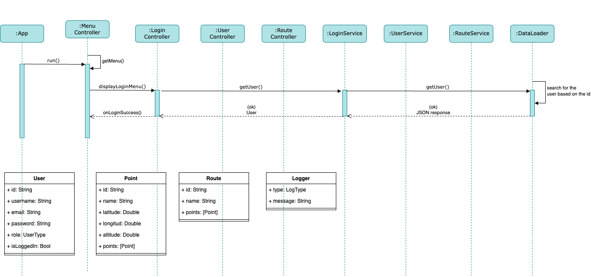

# snow_trails

## Architecture

The core of **SnowTrails** is the `App` entity who starts the app and manage the dependencies used round the project.

```
let app = App()
app.run()
```
Inside `App` I initialize a `MenuController` and its dependencies like `LoginController` that requires a `LoginService` and a `UserDataLoader`.

I have **controllers** to interact whit the user, these controllers uses **services** to manage domain logic and comunicate with the **data loaders**. All of them are _clases_.

## Sequence diagram

At the moment the diagram includes the **Login** flow, ignore the override them entities I wanted to put them somewhere.


## Obligatory functionality

✅ Login Menu

I coded he Login flow using a `LoginController`, a `LoginService`, a `UserDataLoader` and a `user.json` file to host two default users: regular and admin. Throw a delegate called `LoginControllerDelegate` that implement the `MenuController` I close the login menu to start the corresponding user one. Previously I provided feedback to the user for a login sucess. Finally I configured **testing** to add a Login suite.

## Complementary functionality

✅ Login Menu

I coded an option to get the user role using a `UserType`, this enum is created when the `users.json` file is decoded to a `User` entity:

```
enum UserType: String, Codable {
    case regular
    case admin
    
    // It was great create an enum from a JSON response :P
    init?(from decoder: Decoder?) throws {
        let container = try decoder?.singleValueContainer()
        let userRole = try container?.decode(String.self)
        
        switch userRole {
        case UserType.regular.rawValue:
            self = .regular
        case UserType.admin.rawValue:
            self = .admin
        default:
            return nil
        }
    }
}
```
Also I manage the `getUser` response using an `onSuccess` and `onError` closure. Finally the feedback when the login is success includes if is a **regular** or **admin** user.

Continue...